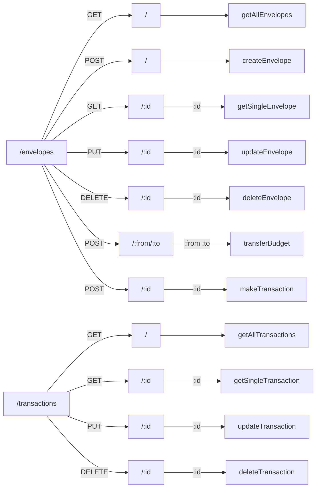
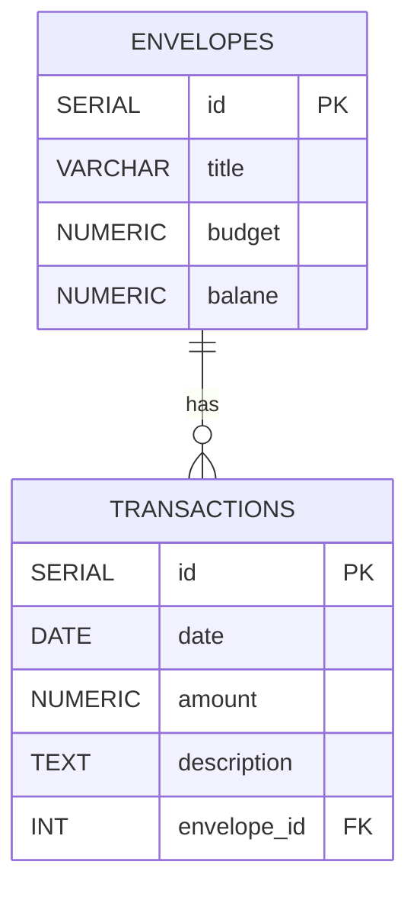

# Personal Budget Project

## Overview

The **`Personal Budget`** project is part of the [Codecademy Back-End Engineer](https://www.codecademy.com/journeys/back-end-engineer/paths/becj-22-back-end-development/tracks/becj-22-personal-budget-i/) career path. It is intended as a `Javascript` Project but my implementation uses `Typescript`.

For this project, I built an API that allows clients to create and manage a personal budget. Using [Envelope Budgeting](https://www.thebalance.com/what-is-envelope-budgeting-1293682) principles, the API allows users to manage budget envelopes and track the balance of each envelope. This API also follows best practices regarding **REST endpoint naming conventions**, proper **response codes**, etc. I have also included **data validation** to ensure users do not overspend their budget.

### Project Objectives:

- Build an API using `Node.js` and `Express`
- Be able to create, read, update, and delete envelopes
- Create endpoints to update envelope balances
- Use `Git` version control to keep track of your work
- Use the command line to navigate your files and folders
- Use `Postman` to test API endpoints

### Prerequisites:

- Command line and file navigation
- `Javascript`
- `Typescript`
- `Node.js`
- `Express`
- `Git` and `GitHub`
- `Postman`

## Project Tasks

- [x] **Create file(s) and install Express:**
      On your computer, create a directory to hold your file(s) for a Node/Express project. Initialize a new Node.js project with `npm`, create a file to run your server, and add the Express library in said file.
      You can start out with a single file called `server.js` or `index.js`. As you progress on your project you might find it best to separate logic under different folders/files in order to make it more scalable.

- [x] **Set up the environment and a simple endpoint:**
      Create an Express app and write out an endpoint to send a `GET` request so that the message “Hello, World” appears when you open `localhost:3000/` in your browser.
      Make sure to write out the necessary code to run a server in your main file and set your port to `3000`. The URL for the landing page is usually `/`. If working correctly, you should be able to navigate to `localhost:3000/` and see your message, “Hello, World” displayed on the browser.

- [x] **Version Control:**
      Set up Git tracking in your directory and make sure to add and commit changes as you make them.
      You can set up your git tracking with `git init`. Remember to add and commit your progress as you move forward with the project.

- [x] **Create your envelopes:**
      Create global variables to store information about your envelopes and total budget. Create an endpoint that sends a POST request in order to generate individual budget envelopes.
      It will be useful to prepend your endpoints with a keyword for your API, such as `/envelopes`. In this case, an array holding objects to represent each envelope might be a useful approach. Each envelope will be represented by a numerical ID and hold information regarding its budget and title.
      Feel free to attach response codes so that users can see if their requests were sent successfully or if there were any errors.

- [x] **Retrieve all your envelopes:**
      Create an endpoint that sends a `GET` request to retrieve all your envelopes. The endpoint can be located in your homepage URL or something more specific if you wish.

- [x] **Test your endpoints with Postman:**
      Using Postman, test your endpoints by creating a few envelopes and see if you can retrieve them by making a `GET` request. Throughout this project, make sure to continuously use Postman to test your endpoints and requests.

- [x] **Retrieve specific envelopes:**
      Create an endpoint that sends a `GET` request in order to retrieve a specific envelope and see their current budget and other information.
      You will be using an envelope’s unique ID in order to retrieve it. This is typically done by parsing the URL parameter for an ID and searching for the envelope with the corresponding ID.
      Make sure to test this in Postman to see if the requests are sent successfully.

- [x] **Update specific envelopes and balances:**
      Create an endpoint that updates specific envelopes when money is being extracted from them. You should also be able to update any other information about an envelope using this endpoint.
      We want to be able to update our total budget and specific envelopes as we extract money from them.
      Depending on how you’ve set up your balance methods, this could either be a `POST` or `PUT` request. If you set a balance to a specific value a `PUT` request will be more appropriate. If you’re constantly subtracting an amount from a balance, then a `POST` request
      Similarly to the `GET` request (for a specific envelope), you can use `req.param()` to search the URL for a parameter. You’ll be sending a value that will be subtracted from the envelope’s budget. Add that logic in the callback function of the endpoint.
      This would be a good place to add some data validation to make sure the correct information is being passed into the request!
      If you want to update other information about a budget envelope you can do that here as well.

- [x] **Delete specific envelopes:**
      Create an endpoint that sends a `DELETE` request and deletes a specific envelope.
      When deleting entities, we typically delete them one by one to avoid big accidental data loss.
      You can use the high order function filter in order to update your budget envelopes and remove the specific envelope from the request parameter.

- [x] **Transfer budgets from different envelopes:**
      Create a `POST` request that uses two parameters and transfers a value from one envelope to another.
      We want the feature to be able to change budgets between envelopes. Perhaps one month we’d like to remove some money from our “dining out” envelope and put it in our “groceries” envelope.
      Your URL might look something like this: `http://localhost:3000/envelopes/transfer/:from/:to`
      This request would take in a `header` value and update the balances of both envelopes by subtracting it from one and adding it to the other.

- [x] **Upload project to GitHub:**
      Make sure all your code has been added and committed with git and upload your project into a new GitHub repository.
      Add a `README.md` with instructions on how to use your API.
      If you created a repository in the early stages of the project, all you need is to push your main branch in order to update to the repo.

# Updates to the Project

In this iteration I have added a persistence layer (database) to store budget envelopes and their balances. I am using `PostgreSQL` as DB and `Swagger` for API documentation for this. I have also added a new endpoint for transactions where users can manage their envelope balances through transactions. Lastly, I have also added some basic test coverage.

## Project Tasks

- [x] Visualize the end result: What is being built? What can it do?
- [x] Design the database: identify what to include in tables and relationships
- [x] Setup database: using `psql` to create the database and roles
- [x] Connect database: using a client or a pool
- [x] Create tables: for envelopes
- [x] Update requests: identify API calls and update them to use the database directly
- [x] Test endpoints: using Postman
- [x] Create transactions: add new feature where user can add transactions
- [x] Create transactions endpoint: add API for the transactions to update the database records
- [x] Continuous Testing: run application and use Postman to test transactions
- [x] Write up documentation: using `Swagger` (check final endpoints and db names)
- [ ] Deploy application to `Render`: push local changes to Github and deploy from there using Render

## Bonus Tasks

- [ ] Add API endpoint to reset envelope balances either manually or scheduled
- [ ] Create a frontend that displays envelopes and balances, and allows users to manage transactions
- [ ] Add Tests: that can be run using `npm test` (incl. `psql` tests)
- [ ] Refactor code and update dependencies (`package.json`) and review project directory structure
- [ ] Improve and enhance test coverage

## Endpoints Visualization



## Postgres Database Visualization



## Installation

1. Clone the repository:
   ```bash
   git clone https://github.com/riascho/Budget-Project.git
   ```
2. Navigate to the project directory:
   ```bash
   cd Budget-Project
   ```
3. Install dependencies:
   ```bash
   npm install
   ```
4. Specify the `postgres` user and database in `.env` config file to be used for the app

## Usage

1. Compile the code:
   ```bash
   npm run build
   ```
2. Start the application:
   ```bash
   npm start
   ```
3. Requests can be made to the `envelopes` and `transactions` endpoints at `http://localhost:3000`

## Testing with Jest

For testing I have chosen an approach of using a dedicated test database to insure tests are isolated and repeatable.
Jest sets the `NODE_ENV=test` and we can use that to [determine which database](/src/db/db.ts) to use. With this setup we automatically create and drop the `envelopes_test` database using the same [prod table creation query](/src/tests/setup.ts). I'm also making sure that all data is cleaned between tests and sequence counters are reset.

I'm also using `supertest`, which makes HTTP requests and eliminates the need for running an actual express server.

To run the tests:

```
npm test
```
