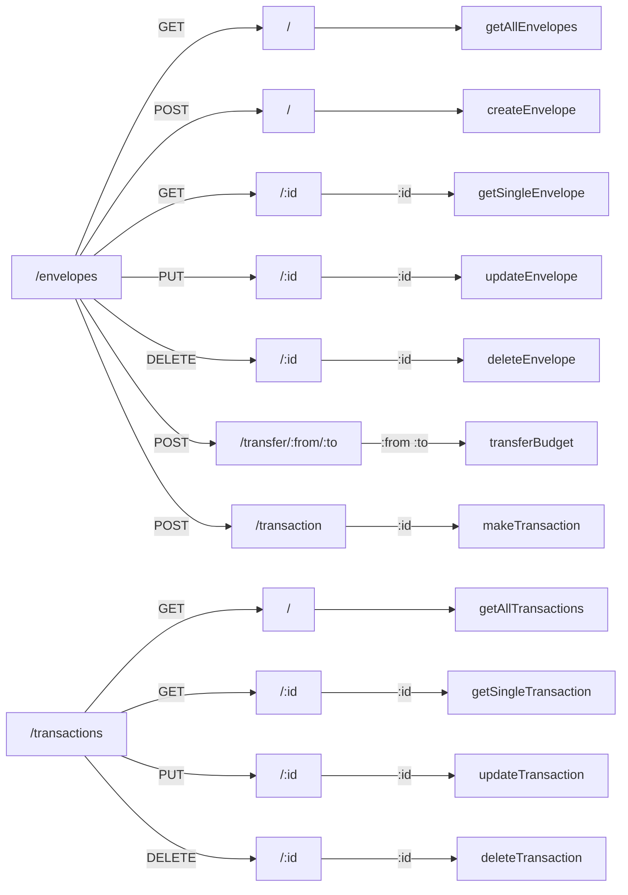
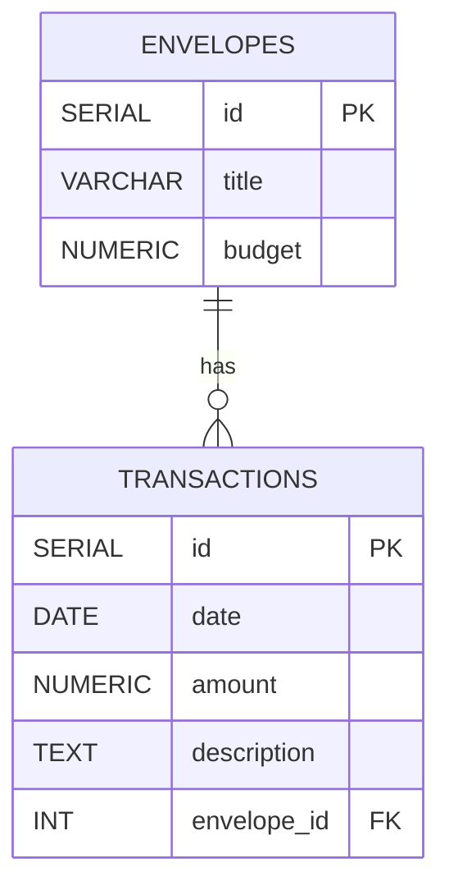

# Updates to the Project

In this iteration I will add a persistence layer (database) to store budget envelopes and their balances. I will use `PostgreSQL` as DB and `Swagger` for API documentation for this. I will also add another feature where users can enter an transaction and it will connect to the database directly.

## Tasks

- [x] Visualize the end result: What is being built? What can it do?
- [x] Design the database: identify what to include in tables and relationships
- [x] Setup database: using `psql` to create the database and roles
- [x] Connect database: using a client or a pool
- [x] Create tables: for envelopes
- [x] Update requests: identify API calls and update them to use the database directly
- [x] Test endpoints: using Postman
- [x] Create transactions: add new feature where user can add transactions
- [x] Create transactions endpoint: add API for the transactions to update the database records
- [x] Continuous Testing: run application and use Postman to test transactions
- [ ] Write up documentation: using `Swagger` (check final endpoints and db names)
- [ ] Deploy application to `Render`: push local changes to Github and deploy from there using Render

## Bonus Tasks

- [ ] Add FrontEnd: create web page that displays envelopes & balances and allows users to manage transactions
- [ ] Add Tests: that can be run using `npm test` (incl. `psql` tests)
- [ ] Refactor code and update dependencies (`package.json`) and review project directory structure

## Endpoints Visualization

## Postgres Database Visualization

## Envelopes

- `ENVELOPES` are initiliazed with budget and title
- only title can be updated
- budget can only be updated via making a transaction

## Transactions

- `TRANSACTIONS` can be both negative and positive
- have to be associated with an envelope
- every transaction affects the envelope's budget
- if transaction would cause envelope's budget to be negative, the transaction is not successfull
- budget can be transferred from one envelope to the other
- this would result in two transactions (e.g. +400 and -400) referencing the exchanging envelopes
