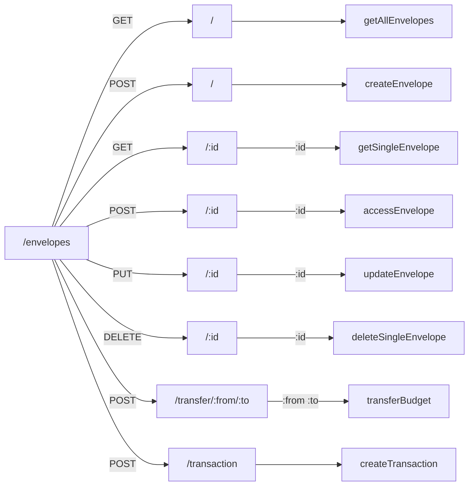
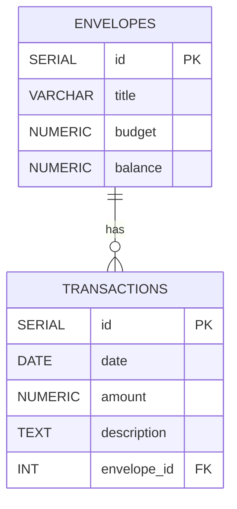

# Updates to the Project

In this iteration I will add a persistence layer (database) to store budget envelopes and their balances. I will use `PostgreSQL` as DB and `Swagger` for API documentation for this. I will also add another feature where users can enter an transaction and it will connect to the database directly.

## Tasks

- [x] Visualize the end result: What is being built? What can it do?
- [x] Design the database: identify what to include in tables and relationships
- [ ] Setup database: using `psql` to create the database and roles
- [ ] Connect database: using a client or a pool
- [ ] Create tables: for envelopes
- [ ] Update requests: identify API calls and update them to use the database directly
- [ ] Test endpoints: using Postman
- [ ] Create transactions: add new feature where user can add transactions
- [ ] Create transactions endpoint: add API for the transactions to update the database records
- [ ] Continuous Testing: run application and use Postman to test transactions
- [ ] Write up documentation: using `Swagger`
- [ ] Deploy application to `Render`: push local changes to Github and deploy from there using Render

## Bonus Tasks

- [ ] Add FrontEnd: create web page that displays envelopes & balances and allows users to manage transactions
- [ ] Add Tests: that can be run using `npm test`
- [ ] Refactor code and update dependencies (`package.json`) and review project directory structure

## Endpoints Visualization

## Postgres Database Visualization

